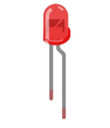

##############################################################################
Chapter Touch Sensor
##############################################################################

ESP32-S3 offers up to 14 capacitive touch GPIO, and as you can see from the previous section, mechanical switches are prone to jitter that must be eliminated when used, which is not the case with ESP32-S3's built-in touch sensor. In addition, on the service life, the touch switch also has advantages that mechanical switch is completely incomparable.

Project Read Touch Sensor
*********************************************

This project reads the value of the touch sensor and prints it out.

Component List
==========================

+-----------------------------+----------------------------------+
| ESP32-S3 WROOM x1           | GPIO Extension Board x1          |
|                             |                                  |
| |Chapter01_00|              | |Chapter01_01|                   |
+-----------------------------+----------------------------------+
| Breadboard x1                                                  |
|                                                                |
| |Chapter01_02|                                                 |
+----------------------------------------------------------------+
| Jumper M/M x1                                                  |
|                                                                |
|  |Chapter01_05|                                                |
+----------------------------------------------------------------+

.. |Chapter01_00| image:: ../_static/imgs/1_LED/Chapter01_00.png
.. |Chapter01_01| image:: ../_static/imgs/1_LED/Chapter01_01.png
.. |Chapter01_02| image:: ../_static/imgs/1_LED/Chapter01_02.png
.. |Chapter01_05| image:: ../_static/imgs/1_LED/Chapter01_05.png

Related knowledge
==============================

Touch sensor
------------------------------

ESP32-S3's touch sensor supports up to 14 GPIO channels as capacitive touch pins. Each pin can be used separately as an independent touch switch or be combined to produce multiple touch points. The following table is a list of available touch pins on ESP32-S3.

+------------------------------+-------------+
| Name of touch sensing signal | GPIO number |
+==============================+=============+
| T1                           | GPIO1       |
+------------------------------+-------------+
| T2                           | GPIO2       |
+------------------------------+-------------+
| T3                           | GPIO3       |
+------------------------------+-------------+
| T4                           | GPIO4       |
+------------------------------+-------------+
| T5                           | GPIO5       |
+------------------------------+-------------+
| T6                           | GPIO6       |
+------------------------------+-------------+
| T7                           | GPIO7       |
+------------------------------+-------------+
| T8                           | GPIO8       |
+------------------------------+-------------+
| T9                           | GPIO9       |
+------------------------------+-------------+
| T10                          | GPIO10      |
+------------------------------+-------------+
| T11                          | GPIO11      |
+------------------------------+-------------+
| T12                          | GPIO12      |
+------------------------------+-------------+
| T13                          | GPIO13      |
+------------------------------+-------------+
| T14                          | GPIO14      |
+------------------------------+-------------+

The touch pin number is already defined in ESP32-S3's code base. For example, in the code, you can use T1 to represent GPIO1.

The electrical signals generated by touch are analog data, which are converted by an internal ADC converter. You may have noticed that all touch pins have ADC functionality.

The hardware connection method is shown in the following figure.

Circuit
============================

.. list-table::
   :width: 100%
   :header-rows: 1 
   :align: center
   
   * -  Schematic diagram
   * -  |Chapter10_01|

   * -  Hardware connection.
      
        :red:`If you need any support, please feel free to contact us via:` support@freenove.com
     -  |Chapter10_02|

Sketch
============================

Sketch_TouchRead
----------------------------

Download the code to ESP32-S3 WROOM, open the serial monitor, and set the baud rate to 115200. Touch jumper with hand. As shown in the following figure, 

Reference
---------------------------

.. py:function:: uint16_t touchRead(uint8_t pin);	

Read touch sensor value. (values close to 0 mean touch detected)

Project Touch Lamp
***********************************

In this project, we will use ESP32-S3's touch sensor to create a touch switch lamp.

Component List
====================================

+-----------------------------+----------------------------------+
| ESP32-S3 WROOM x1           | GPIO Extension Board x1          |
|                             |                                  |
| |Chapter01_00|              | |Chapter01_01|                   |
+-----------------------------+----------------------------------+
| Breadboard x1                                                  |
|                                                                |
| |Chapter01_02|                                                 |
+-------------------+------------------+-------------------------+
| LED x1            | Resistor 220Ω x1 | Jumper M/M x3           |
|                   |                  |                         |
| |Chapter01_03|    | |Chapter01_04|   | |Chapter01_05|          |
+-------------------+------------------+-------------------------+

.. |Chapter01_00| image:: ../_static/imgs/1_LED/Chapter01_00.png
.. |Chapter01_01| image:: ../_static/imgs/1_LED/Chapter01_01.png
.. |Chapter01_02| image:: ../_static/imgs/1_LED/Chapter01_02.png

.. |Chapter01_04| image:: ../_static/imgs/1_LED/Chapter01_04.png
.. |Chapter01_05| image:: ../_static/imgs/1_LED/Chapter01_05.png

Circuit
============================

.. list-table::
   :width: 100%
   :header-rows: 1 
   :align: center
   
   * -  Schematic diagram
   * -  |Chapter10_06|

   * -  Hardware connection.
      
        :red:`If you need any support, please feel free to contact us via:` support@freenove.com
     -  |Chapter10_07|

.. |Chapter10_06| image:: ../_static/imgs/10_Touch_Sensor/Chapter10_06.png
.. |Chapter10_07| image:: ../_static/imgs/9_AD_Converter/Chapter10_07.png

Sketch
=============================

Sketch_TouchLamp
------------------------------

Download the code to ESP32-S3 WROOM, open the serial monitor, and set the baud rate to 115200. Touch jumper with hand. As shown in the following figure, 

.. image:: ../_static/imgs/10_Touch_Sensor/Chapter10_09png
    :align: center

With a touch pad, the state of the LED changes with each touch, and the detection state of the touch sensor is printed in the serial monitor.

The following is the program code:

.. image:: ../_static/imgs/10_Touch_Sensor/Chapter10_09png
    :align: center

.. literalinclude:: ../../../freenove_Kit/C/Sketches/Sketch_10.2_TouchLamp/Sketch_10.2_TouchLamp.ino
    :linenos: 
    :language: c
    :dedent:

Due to different operating environments, the return value of the function touchRead() may not be the same or similar. Therefore, with the help of Project 10.1, we can know the return values of touchRead() in different states, and based on these return values, we can set a valid threshold range for the touch function.

For example, when touchRead() returns a value greater than 200000, we consider the touch function to be triggered by a human. Similarly, when the return value of touchRead() is less than 60000, we consider that the touch function has not been triggered by someone. Note that the threshold range here can be modified by users according to their own conditions

.. literalinclude:: ../../../freenove_Kit/C/Sketches/Sketch_10.2_TouchLamp/Sketch_10.2_TouchLamp.ino
    :linenos: 
    :language: c
    :lines: 8-9
    :dedent:

In loop(), first determine whether the touch was detected. If yes, print some messages, flip the state of the LED, and set the flag bit **isProcessed** to true to avoid repeating the program after the touch was successful.

.. literalinclude:: ../../../freenove_Kit/C/Sketches/Sketch_10.2_TouchLamp/Sketch_10.2_TouchLamp.ino
    :linenos: 
    :language: c
    :lines: 17-23
    :dedent:

It then determines if the touch key is released, and if so, prints some messages and sets the isProcessed to false to avoid repeating the process after the touch release and to prepare for the next touch probe.

.. literalinclude:: ../../../freenove_Kit/C/Sketches/Sketch_10.2_TouchLamp/Sketch_10.2_TouchLamp.ino
    :linenos: 
    :language: c
    :lines: 24-29
    :dedent: