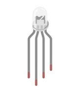
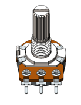
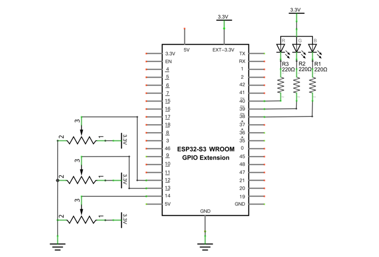
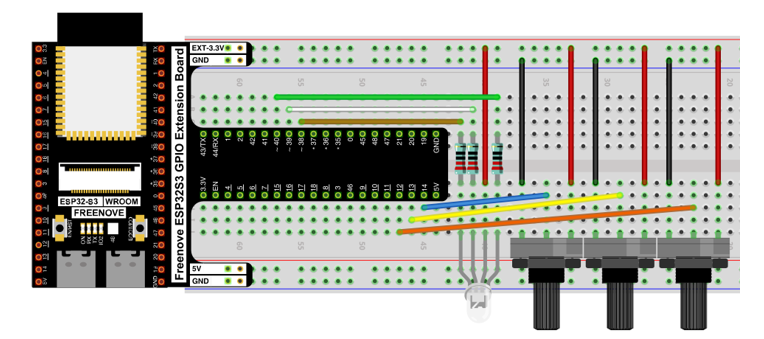
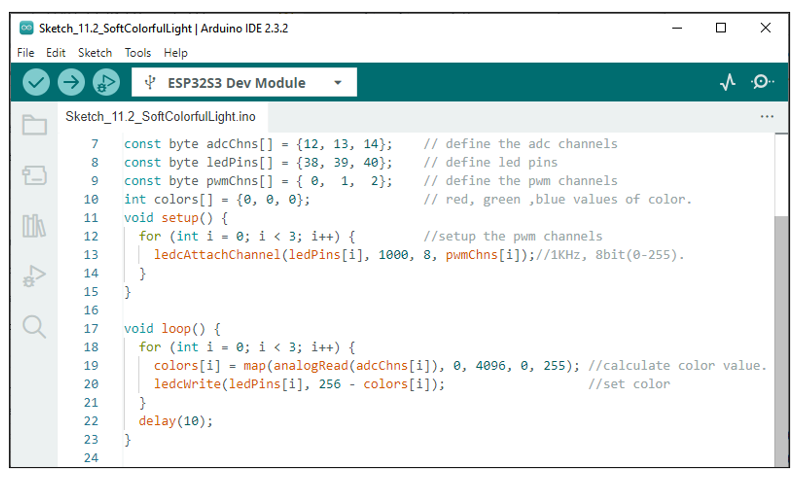

Project Soft Colorful Light 
*****************************************

In this project, 3 potentiometers are used to control the RGB LED and in principle it is the same as the Soft Light project. Namely, read the voltage value of the potentiometer and then convert it to PWM used to control LED brightness. Difference is that the original project only controlled one LED, but this project required (3) RGB LEDs.

Component List
==================================

+-----------------------------+-----------------------------------------------------------+
| ESP32-S3 WROOM x1           | GPIO Extension Board x1                                   |
|                             |                                                           |
| |Chapter01_00|              | |Chapter01_01|                                            |
+-----------------------------+-----------------------------------------------------------+
| Breadboard x1                                                                           |
|                                                                                         |
| |Chapter01_02|                                                                          |
+-------------------+------------------+-----------------+--------------------------------+
| RGBLED x1         | Resistor 220Ω x1 | Jumper M/M x13  | Rotary potentiometer x3        |
|                   |                  |                 |                                |
| |Chapter05_00|    | |Chapter01_04|   | |Chapter01_05|  |   |Chapter09_00|               |
+-------------------+------------------+-----------------+--------------------------------+

.. |Chapter01_00| image:: ../_static/imgs/1_LED/Chapter01_00.png
.. |Chapter01_01| image:: ../_static/imgs/1_LED/Chapter01_01.png
.. |Chapter01_02| image:: ../_static/imgs/1_LED/Chapter01_02.png
.. |Chapter01_04| image:: ../_static/imgs/1_LED/Chapter01_04.png
.. |Chapter01_05| image:: ../_static/imgs/1_LED/Chapter01_05.png

Circuit
===================================

.. list-table::
   :width: 100%
   :header-rows: 1 
   :align: center
   
   * -  Schematic diagram
   * -  |Chapter11_02|

   * -  Hardware connection.
      
        :red:`If you need any support, please feel free to contact us via:` support@freenove.com
   * -  |Chapter11_03|

Sketch
==================================

Sketch_SoftColorfulLight
-----------------------------------

Download the code to ESP32-S3 WROOM, by turning the adjustable resistor to change the input voltage of GPIO19, ESP32-S3 changes the output voltage of GPIO14 according to this voltage value, thus changing the brightness of the LED.

:red:`If you have any concerns, please contact us via:` support@freenove.com

The following is the program code:

.. literalinclude:: ../../../freenove_Kit/C/Sketches/Sketch_11.2_SoftColorfulLight/Sketch_11.2_SoftColorfulLight.ino
    :linenos: 
    :language: c
    :dedent:

In the code you can read the ADC values of the 3 potentiometers and map it into a PWM duty cycle to control the 3 LED elements to vary the color of their respective RGB LED.

.. include:: 11_3_Potentiometer_&_LED.rst