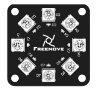
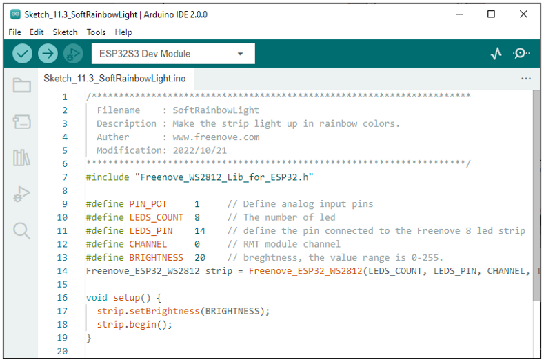
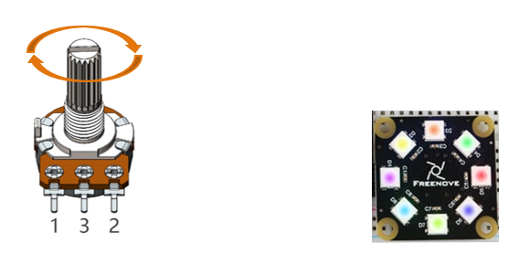

Project Soft Rainbow Light
*****************************************

In this project, we use potentiometer to control Freenove 8 RGB LED Module.

Component List
======================================

+--------------------------------------------+----------------------------------------+
| ESP32-S3 WROOM x1                          | GPIO Extension Board x1                |
|                                            |                                        |
| |Chapter01_00|                             | |Chapter01_01|                         |
+--------------------------------------------+----------------------------------------+
| Breadboard x1                                                                       |
|                                                                                     |
| |Chapter01_02|                                                                      |
+----------------------------------+------------------------+-------------------------+
| Freenove 8 RGB LED Module x1     | Rotary potentiometer x1| Jumper M/M x2           |
|                                  |                        |                         |
|                                  |                        | Jumper M/M x3           |
|                                  |                        |                         |
| |Chapter06_00|                   | |Chapter09_00|         | |Chapter11_06|          |
+----------------------------------+------------------------+-------------------------+

.. |Chapter01_00| image:: ../_static/imgs/1_LED/Chapter01_00.png
.. |Chapter01_01| image:: ../_static/imgs/1_LED/Chapter01_01.png
.. |Chapter01_02| image:: ../_static/imgs/1_LED/Chapter01_02.png
.. |Chapter09_00| image:: ../_static/imgs/9_AD_Converter/Chapter09_00.png

.. |Chapter11_06| image:: ../_static/imgs/11_Potentiometer_&_LED/Chapter11_06.png

Circuit
=================================

.. list-table::
   :width: 100%
   :header-rows: 1 
   :align: center
   
   * -  Schematic diagram
   * -  |Chapter11_07|

   * -  Hardware connection.
      
        :red:`If you need any support, please feel free to contact us via:` support@freenove.com
     -  |Chapter11_08|

.. |Chapter11_07| image:: ../_static/imgs/11_Potentiometer_&_LED/Chapter11_07.png
.. |Chapter11_08| image:: ../_static/imgs/11_Potentiometer_&_LED/Chapter11_08.png

Sketch
==================================

Sketch_Soft_Rainbow_Light
-----------------------------------

Download the code to ESP32-S3 WROOM, rotate the handle of the potentiometer, and the color of the lamp ring will change. 

The following is the program code:

.. literalinclude:: ../../../freenove_Kit/C/Sketches/Sketch_11.3_SoftRainbowLight/Sketch_11.3_SoftRainbowLight.ino
    :linenos: 
    :language: c
    :dedent:

The overall logical structure of the code is the same as the previous project rainbow light, except that the starting point of the color in this code is controlled by potentiometer.