##############################################################################
Chapter Potentiometer & LED
##############################################################################

Earlier we have learned the use of ADC and PWM. In this chapter, we will learn how to use a potentiometer to control the brightness of an LED.

Project Soft Light
**********************************

In this project, we will make a soft light. We will use an ADC Module to read ADC values of a potentiometer and map it to duty cycle of the PWM used to control the brightness of a LED. Then you can change the brightness of a LED by adjusting the potentiometer.

Component List
===============================

+-----------------------------+-----------------------------------------------------------+
| ESP32-S3 WROOM x1           | GPIO Extension Board x1                                   |
|                             |                                                           |
| |Chapter01_00|              | |Chapter01_01|                                            |
+-----------------------------+-----------------------------------------------------------+
| Breadboard x1                                                                           |
|                                                                                         |
| |Chapter01_02|                                                                          |
+-------------------+------------------+-----------------+--------------------------------+
| LED x1            | Resistor 220Ω x1 | Jumper M/M x2   | Rotary potentiometer x1        |
|                   |                  |                 |                                |
| |Chapter01_03|    | |Chapter01_04|   | |Chapter01_05|  |   |Chapter09_00|               |
+-------------------+------------------+-----------------+--------------------------------+

.. |Chapter01_00| image:: ../_static/imgs/1_LED/Chapter01_00.png
.. |Chapter01_01| image:: ../_static/imgs/1_LED/Chapter01_01.png
.. |Chapter01_02| image:: ../_static/imgs/1_LED/Chapter01_02.png
.. |Chapter01_03| image:: ../_static/imgs/1_LED/Chapter01_03.png
    :width: 50%
.. |Chapter01_04| image:: ../_static/imgs/1_LED/Chapter01_04.png
.. |Chapter01_05| image:: ../_static/imgs/1_LED/Chapter01_05.png
.. |Chapter09_00| image:: ../_static/imgs/9_AD_Converter/Chapter09_00.png

Circuit
=================================

.. list-table::
   :width: 100%
   :header-rows: 1 
   :align: center
   
   * -  Schematic diagram
   * -  |Chapter11_00|

   * -  Hardware connection.

        :red:`If you need any support, please feel free to contact us via:` support@freenove.com
     -  |Chapter11_04|

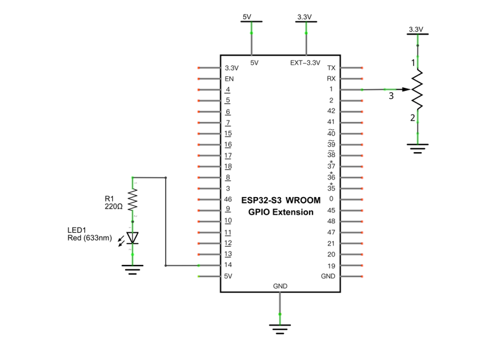
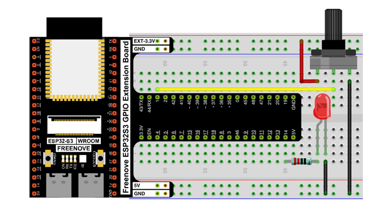

Sketch
==================================

Sketch_Softlight
------------------------------------

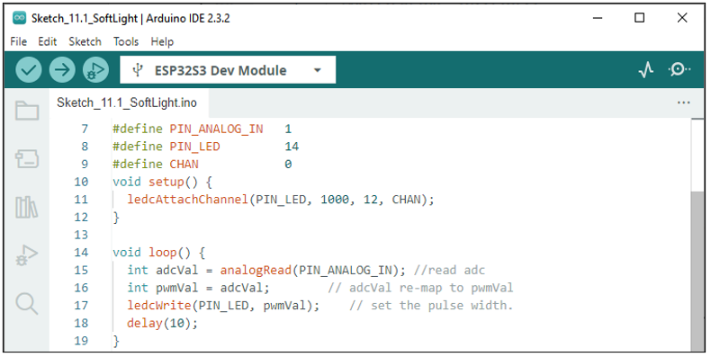

Download the code to ESP32-S3 WROOM, by turning the adjustable resistor to change the input voltage of GPIO19, ESP32-S3 changes the output voltage of GPIO14 according to this voltage value, thus changing the brightness of the LED.

The following is the code:

.. literalinclude:: ../../../freenove_Kit/C/Sketches/Sketch_11.1_SoftLight/Sketch_11.1_SoftLight.ino
    :linenos: 
    :language: c
    :dedent:

In the code, read the ADC value of potentiometer and map it to the duty cycle of PWM to control LED brightness.

Project Soft Colorful Light 
*****************************************

In this project, 3 potentiometers are used to control the RGB LED and in principle it is the same as the Soft Light project. Namely, read the voltage value of the potentiometer and then convert it to PWM used to control LED brightness. Difference is that the original project only controlled one LED, but this project required (3) RGB LEDs.

Component List
==================================

+-----------------------------+-----------------------------------------------------------+
| ESP32-S3 WROOM x1           | GPIO Extension Board x1                                   |
|                             |                                                           |
| |Chapter01_00|              | |Chapter01_01|                                            |
+-----------------------------+-----------------------------------------------------------+
| Breadboard x1                                                                           |
|                                                                                         |
| |Chapter01_02|                                                                          |
+-------------------+------------------+-----------------+--------------------------------+
| RGBLED x1         | Resistor 220Ω x1 | Jumper M/M x13  | Rotary potentiometer x3        |
|                   |                  |                 |                                |
| |Chapter05_00|    | |Chapter01_04|   | |Chapter01_05|  |   |Chapter09_00|               |
+-------------------+------------------+-----------------+--------------------------------+

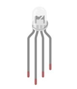

Circuit
===================================

.. list-table::
   :width: 100%
   :header-rows: 1 
   :align: center
   
   * -  Schematic diagram
   * -  |Chapter11_02|

   * -  Hardware connection.
      
        :red:`If you need any support, please feel free to contact us via:` support@freenove.com
     -  |Chapter11_03|

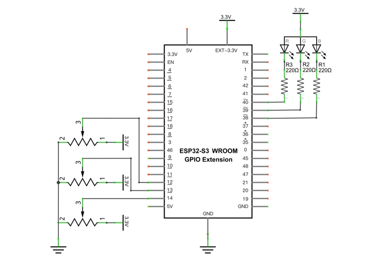
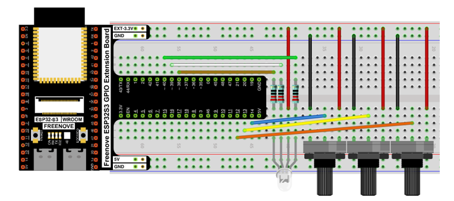

Sketch
==================================

Sketch_SoftColorfulLight
-----------------------------------

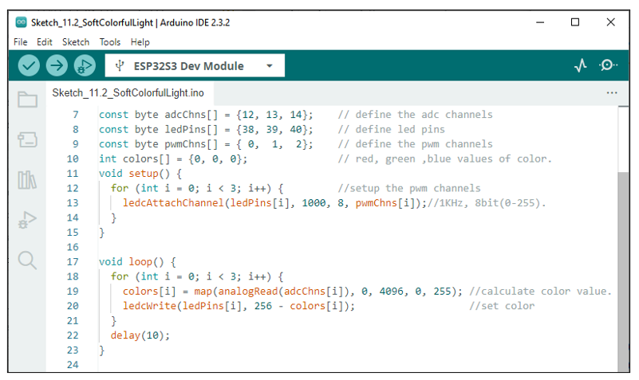

Download the code to ESP32-S3 WROOM, by turning the adjustable resistor to change the input voltage of GPIO19, ESP32-S3 changes the output voltage of GPIO14 according to this voltage value, thus changing the brightness of the LED.

:red:`If you have any concerns, please contact us via:` support@freenove.com

The following is the program code:

.. literalinclude:: ../../../freenove_Kit/C/Sketches/Sketch_11.2_SoftColorfulLight/Sketch_11.2_SoftColorfulLight.ino
    :linenos: 
    :language: c
    :dedent:

In the code you can read the ADC values of the 3 potentiometers and map it into a PWM duty cycle to control the 3 LED elements to vary the color of their respective RGB LED.

Project Soft Rainbow Light
*****************************************

In this project, we use potentiometer to control Freenove 8 RGB LED Module.

Component List
======================================

+--------------------------------------------+----------------------------------------+
| ESP32-S3 WROOM x1                          | GPIO Extension Board x1                |
|                                            |                                        |
| |Chapter01_00|                             | |Chapter01_01|                         |
+--------------------------------------------+----------------------------------------+
| Breadboard x1                                                                       |
|                                                                                     |
| |Chapter01_02|                                                                      |
+----------------------------------+------------------------+-------------------------+
| Freenove 8 RGB LED Module x1     | Rotary potentiometer x1| Jumper M/M x2           |
|                                  |                        |                         |
|                                  |                        | Jumper M/M x3           |
|                                  |                        |                         |
| |Chapter06_00|                   | |Chapter09_00|         | |Chapter11_06|          |
+----------------------------------+------------------------+-------------------------+

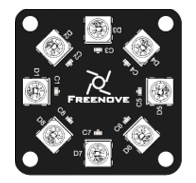
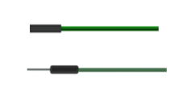

Circuit
=================================

.. list-table::
   :width: 100%
   :header-rows: 1 
   :align: center
   
   * -  Schematic diagram
   * -  |Chapter11_07|

   * -  Hardware connection.
      
        :red:`If you need any support, please feel free to contact us via:` support@freenove.com
     -  |Chapter11_08|

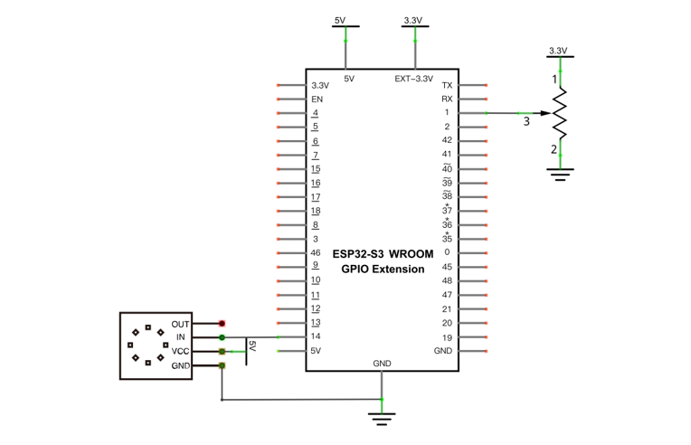
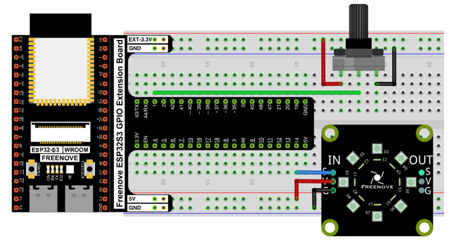

Sketch
==================================

Sketch_Soft_Rainbow_Light
-----------------------------------

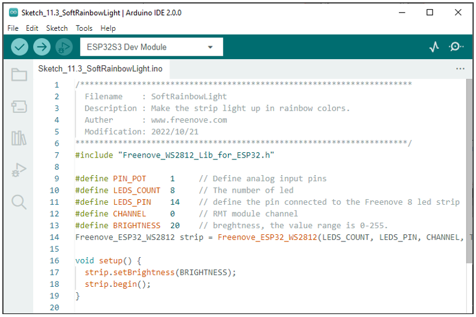

Download the code to ESP32-S3 WROOM, rotate the handle of the potentiometer, and the color of the lamp ring will change. 

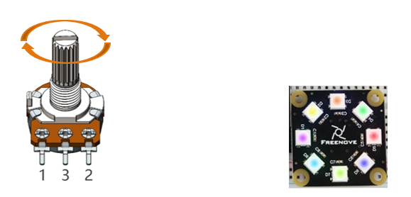

The following is the program code:

.. literalinclude:: ../../../freenove_Kit/C/Sketches/Sketch_11.3_SoftRainbowLight/Sketch_11.3_SoftRainbowLight.ino
    :linenos: 
    :language: c
    :dedent:

The overall logical structure of the code is the same as the previous project rainbow light, except that the starting point of the color in this code is controlled by potentiometer.