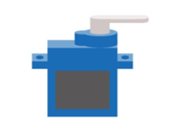
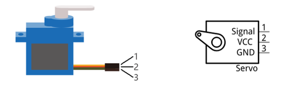
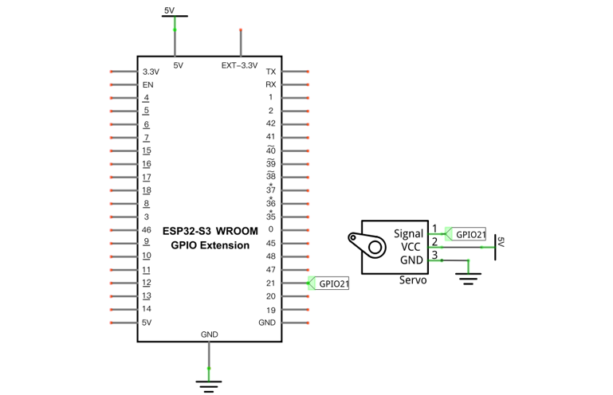
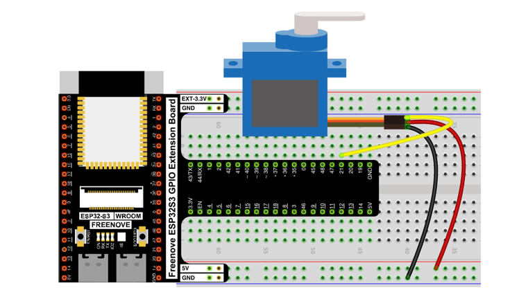
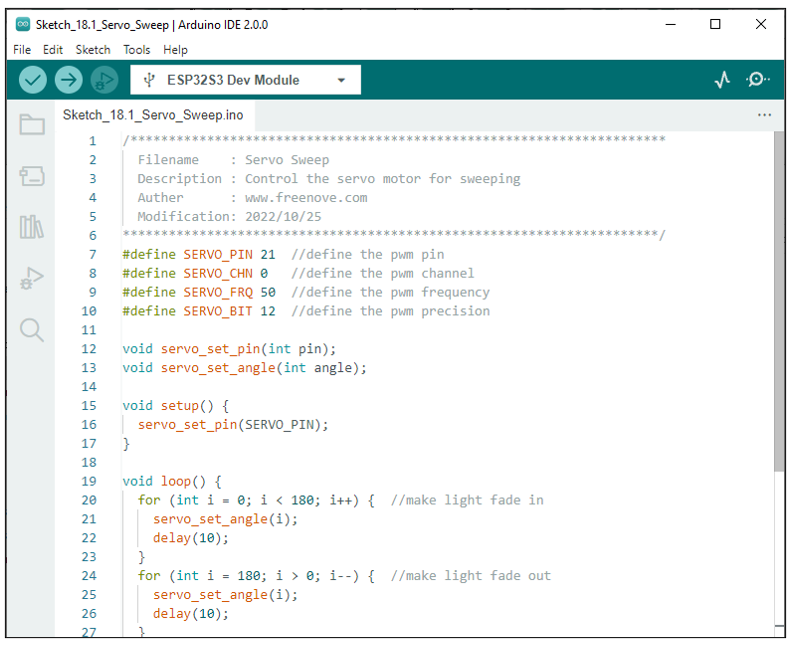
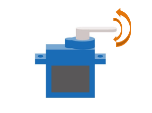
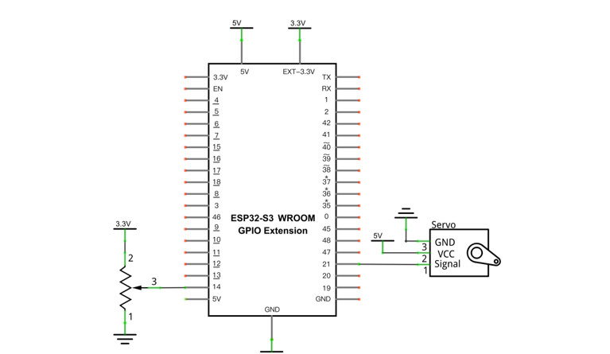
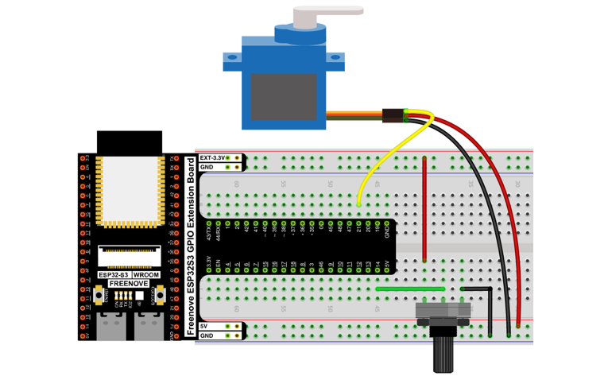
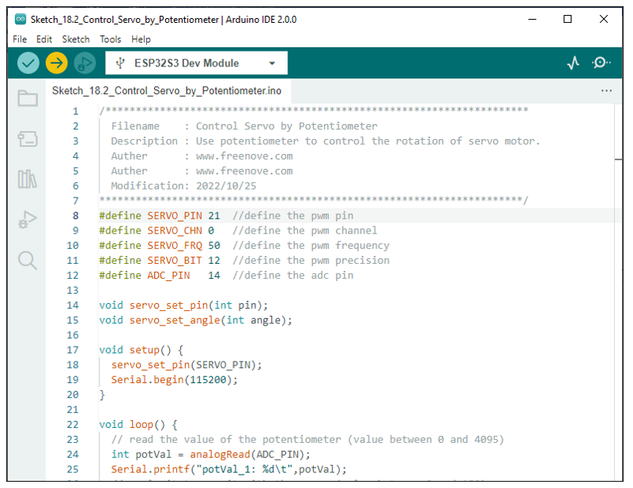
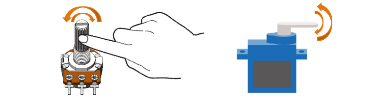

##############################################################################
Chapter Servo
##############################################################################

Previously, we learned how to control the speed and rotational direction of a motor. In this chapter, we will learn about servos which are a rotary actuator type motor that can be controlled to rotate to specific angles.

Project Servo Sweep
********************************

First, we need to learn how to make a servo rotate.

Component List
==========================

+-----------------------------+----------------------------------+
| ESP32-S3 WROOM x1           | GPIO Extension Board x1          |
|                             |                                  |
| |Chapter01_00|              | |Chapter01_01|                   |
+-----------------------------+----------------------------------+
| Breadboard x1                                                  |
|                                                                |
| |Chapter01_02|                                                 |
+-----------------------------+----------------------------------+
| Servo x1                    | Jumper M/M x3                    |
|                             |                                  |
| |Chapter18_00|              |  |Chapter01_05|                  |
+-----------------------------+----------------------------------+

.. |Chapter01_00| image:: ../_static/imgs/1_LED/Chapter01_00.png
.. |Chapter01_01| image:: ../_static/imgs/1_LED/Chapter01_01.png
.. |Chapter01_02| image:: ../_static/imgs/1_LED/Chapter01_02.png
.. |Chapter01_05| image:: ../_static/imgs/1_LED/Chapter01_05.png

Component knowledge
==========================

Servo
--------------------------

Servo is a compact package which consists of a DC motor, a set of reduction gears to provide torque, a sensor and control circuit board. Most servos only have a 180-degree range of motion via their "horn". Servos can output higher torque than a simple DC motor alone and they are widely used to control motion in model cars, model airplanes, robots, etc. Servos have three wire leads which usually terminate to a male or female 3-pin plug. Two leads are for electric power: positive (2-VCC, Red wire), negative (3-GND, Brown wire), and the signal line (1-Signal, Orange wire), as represented in the Servo provided in your Kit.

We will use a 50Hz PWM signal with a duty cycle in a certain range to drive the Servo. The lasting time of 0.5ms-2.5ms of PWM single cycle high level corresponds to the servo angle 0 degrees - 180 degree linearly. Part of the corresponding values are as follows:

+-----------------+-------------+
| High level time | Servo angle |
+=================+=============+
| 0.5ms           | 0 degree    |
+-----------------+-------------+
| 1ms             | 45 degree   |
+-----------------+-------------+
| 1.5ms           | 0 degree    |
+-----------------+-------------+
| 2ms             | 45 degree   |
+-----------------+-------------+
| 2.5ms           | 180 degree  |
+-----------------+-------------+

When you change the servo signal value, the servo will rotate to the designated angle.

Circuit
==========================

Use caution when supplying power to the servo, it should be 5V. Make sure you do not make any errors when connecting the servo to the power supply.

.. list-table::
   :width: 100%
   :header-rows: 1 
   :align: center
   
   * -  Schematic diagram
   * -  |Chapter18_02|

   * -  Hardware connection.
      
        :red:`If you need any support, please feel free to contact us via:` support@freenove.com
     -  |Chapter18_03|

Sketch
===========================

Sketch_Servo_Sweep
----------------------------

Compile and upload the code to ESP32-S3 WROOM, the servo will rotate from 0 degrees to 180 degrees and then reverse the direction to make it rotate from 180 degrees to 0 degrees and repeat these actions in an endless loop.

The following is the program code:

.. literalinclude:: ../../../freenove_Kit/C/Sketches/Sketch_18.1_Servo_Sweep/Sketch_18.1_Servo_Sweep.ino
    :linenos: 
    :language: c
    :dedent:

Define the pins controlling Servo and the frequency and duty cycle of the signal.

.. literalinclude:: ../../../freenove_Kit/C/Sketches/Sketch_18.1_Servo_Sweep/Sketch_18.1_Servo_Sweep.ino
    :linenos: 
    :language: c
    :lines: 7-10
    :dedent:

Initialize Servo pin. Here, PWM control mode is used to control Servo motor.

.. literalinclude:: ../../../freenove_Kit/C/Sketches/Sketch_18.1_Servo_Sweep/Sketch_18.1_Servo_Sweep.ino
    :linenos: 
    :language: c
    :lines: 30-32
    :dedent:

Write a function to control the rotation angle of Servo. The angle range is 0-180 degrees.

.. literalinclude:: ../../../freenove_Kit/C/Sketches/Sketch_18.1_Servo_Sweep/Sketch_18.1_Servo_Sweep.ino
    :linenos: 
    :language: c
    :lines: 34-39
    :dedent:

Control the steering gear to rotate from 0 ° to 180 °, and then rotate from 180 ° to 0 °, and keep rotating circularly.

.. literalinclude:: ../../../freenove_Kit/C/Sketches/Sketch_18.1_Servo_Sweep/Sketch_18.1_Servo_Sweep.ino
    :linenos: 
    :language: c
    :lines: 20-27
    :dedent:

Project Servo Knop
**********************************

Use a potentiometer to control the servo motor to rotate at any angle.

Component List
=============================

+-----------------------------+----------------------------------+
| ESP32-S3 WROOM x1           | GPIO Extension Board x1          |
|                             |                                  |
| |Chapter01_00|              | |Chapter01_01|                   |
+-----------------------------+----------------------------------+
| Breadboard x1               | Rotary potentiometer x1          |
|                             |                                  |
| |Chapter01_02|              | |Chapter09_00|                   |
+-----------------------------+----------------------------------+
| Servo x1                    | Jumper M/M x3                    |
|                             |                                  |
| |Chapter18_00|              |  |Chapter01_05|                  |
+-----------------------------+----------------------------------+

.. |Chapter09_00| image:: ../_static/imgs/9_AD_Converter/Chapter09_00.png

Circuit
=============================

Use caution when supplying power to the servo, it should be 5V. Make sure you do not make any errors when connecting the servo to the power supply.

.. list-table::
   :width: 100%
   :header-rows: 1 
   :align: center
   
   * -  Schematic diagram
   * -  |Chapter18_06|

   * -  Hardware connection.
      
        :red:`If you need any support, please feel free to contact us via:` support@freenove.com
     -  |Chapter18_07|

Sketch
=================================

Sketch_Servo_Sweep
--------------------------------

Compile and upload the code to ESP32-S3 WROOM, twist the potentiometer back and forth, and the servo motor rotates accordingly.

The following is the program code:

.. literalinclude:: ../../../freenove_Kit/C/Sketches/Sketch_18.2_Control_Servo_by_Potentiometer/Sketch_18.2_Control_Servo_by_Potentiometer.ino
    :linenos: 
    :language: c
    :dedent:

In this experiment, we obtain the ADC value of the potentiometer and store it in potVal. Use map function to convert it into corresponding angle value and we can control the motor to rotate to a specified angle, and print the value via serial.