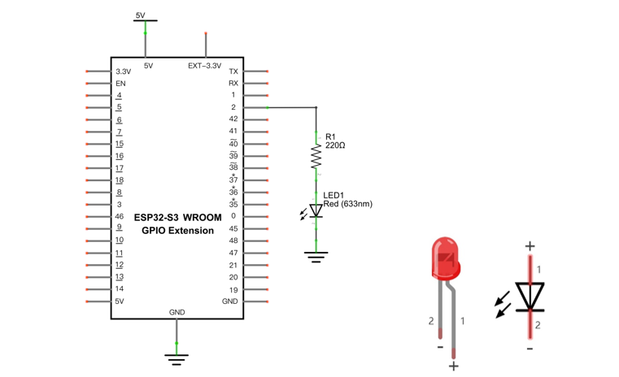
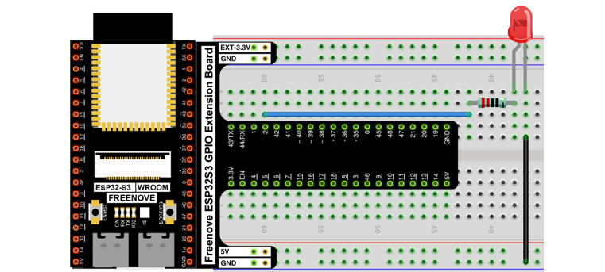
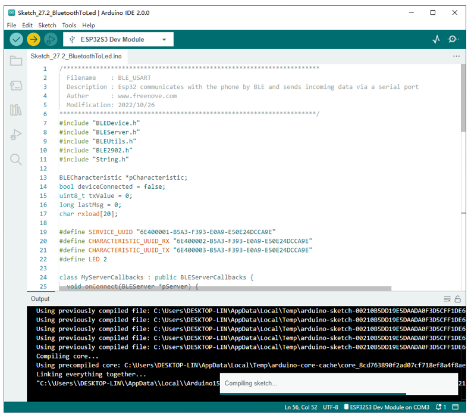
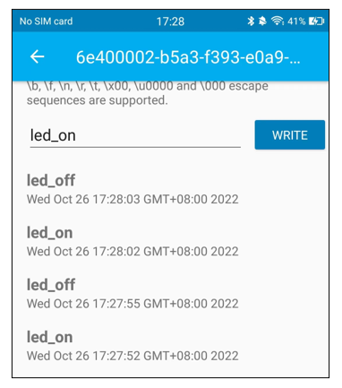
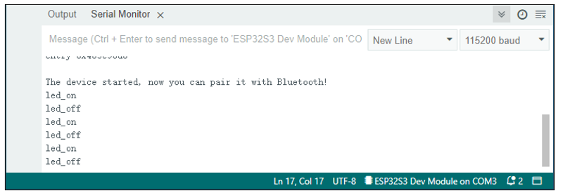
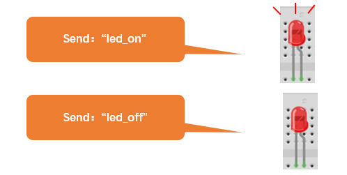

Project Bluetooth Control LED
*****************************************

In this section, we will control the LED with Bluetooth.

Component List
================================

+-----------------------------+----------------------------------+
| ESP32-S3 WROOM x1           | GPIO Extension Board x1          |
|                             |                                  |
| |Chapter01_00|              | |Chapter01_01|                   |
+-----------------------------+----------------------------------+
| Breadboard x1                                                  |
|                                                                |
| |Chapter01_02|                                                 |
+-----------------------------+----------------------------------+
| Resistor 220Ω x1            | Jumper M/M x2                    |
|                             |                                  |
| |Chapter01_04|              |  |Chapter19_02|                  |
+-----------------------------+----------------------------------+
| LED x1                      | Micro USB Wire x1                |
|                             |                                  |
| |Chapter01_04|              |  |Chapter08_00|                  |
+-----------------------------+----------------------------------+

.. |Chapter01_00| image:: ../_static/imgs/1_LED/Chapter01_00.png
.. |Chapter01_01| image:: ../_static/imgs/1_LED/Chapter01_01.png
.. |Chapter01_02| image:: ../_static/imgs/1_LED/Chapter01_02.png
.. |Chapter01_04| image:: ../_static/imgs/1_LED/Chapter01_04.png

.. |Chapter08_00| image:: ../_static/imgs/8_Serial_Communication/Chapter08_00.png

Circuit
=================================

Connect Freenove ESP32-S3 to the computer using a USB cable.

.. list-table::
   :width: 100%
   :align: center
   
   * -  Schematic diagram
   * -  |Chapter27_12|
   * -  Hardware connection. 
       
        :red:`If you need any support, please contact us via:` support@freenove.com
   * -  |Chapter27_13|

Sketch
=================================

Sketch_Bluetooth_Control_LED
-------------------------------------------

Compile and upload code to ESP32S3_Blueooth. The operation of the APP is the same as 27.1, you only need to change the sending content to "led_on" and "led_off" to operate LEDs on the ESP32-S3 WROOM. Data sent from mobile APP:

Display on the serial port of the computer:

The phenomenon of LED

Attention: If the sending content isn't "led-on' or "led-off", then the state of LED will not change. If the LED is on, when receiving irrelevant content, it keeps on; Correspondingly, if the LED is off, when receiving irrelevant content, it keeps off.

The following is the program code:

.. literalinclude:: ../../../freenove_Kit/C/Sketches/Sketch_27.2_BluetoothToLed/Sketch_27.2_BluetoothToLed.ino
    :linenos: 
    :language: c
    :dedent:

Use character string to handle function header file.

.. literalinclude:: ../../../freenove_Kit/C/Sketches/Sketch_27.2_BluetoothToLed/Sketch_27.2_BluetoothToLed.ino
    :linenos: 
    :language: c
    :lines: 11-11
    :dedent:

Define a character array to save data from Bluetooth.

.. literalinclude:: ../../../freenove_Kit/C/Sketches/Sketch_27.2_BluetoothToLed/Sketch_27.2_BluetoothToLed.ino
    :linenos: 
    :language: c
    :lines: 17-17
    :dedent:

Initialize the BLE Bluetooth and name it as "ESP32-S3"

.. literalinclude:: ../../../freenove_Kit/C/Sketches/Sketch_27.2_BluetoothToLed/Sketch_27.2_BluetoothToLed.ino
    :linenos: 
    :language: c
    :lines: 65-65
    :dedent:

Write a Callback function for BLE server to manage connection of BLE.

.. literalinclude:: ../../../freenove_Kit/C/Sketches/Sketch_27.2_BluetoothToLed/Sketch_27.2_BluetoothToLed.ino
    :linenos: 
    :language: c
    :lines: 24-32
    :dedent:

Write Callback function with BLE features. When it is called, as the mobile terminal send data to ESP32-S3, it will store them into reload.

.. literalinclude:: ../../../freenove_Kit/C/Sketches/Sketch_27.2_BluetoothToLed/Sketch_27.2_BluetoothToLed.ino
    :linenos: 
    :language: c
    :lines: 36-44
    :dedent:

Compare the content in buffer array with "led_on" and "led_off" to see whether they are the same. If yes, execute the corresponding operation. 

.. literalinclude:: ../../../freenove_Kit/C/Sketches/Sketch_27.2_BluetoothToLed/Sketch_27.2_BluetoothToLed.ino
    :linenos: 
    :language: c
    :lines: 73-82
    :dedent:

After comparing the content of array, to ensure successful transmission next time, please empty the array.

.. literalinclude:: ../../../freenove_Kit/C/Sketches/Sketch_27.2_BluetoothToLed/Sketch_27.2_BluetoothToLed.ino
    :linenos: 
    :language: c
    :lines: 80-81
    :dedent:

Reference
-----------------------------

strncmp() functions are often used for string comparisons, which are accurate and stable.

.. py:function:: int strncmp(const char *str1, const char *str2, size_t n)	

    str1: the first string to be compared 

    str2: the second string to be compared 

    n: the biggest string to be compared

    Return value: if stir1>str2, then return value>0.

        If return value is 0, then the contents of str1 and str2 are the same.

        If str1< str2, then return value<0.
    
Function memset is mainly used to clean and initialize the memory of array

.. py:function:: void memset(void *s, int c, unsigned long n)	

    Function memset() is to set the content of a certain internal storage as specified value.

    *s: the initial address of the content to clear out. 

    c:to be replaced as specified value 

    n: the number of byte to be replaced