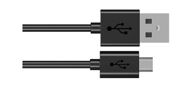

##############################################################################
Chapter Play SD card music
##############################################################################

In the previous study, we have learned how to use the SD card, and then we will learn to play the music in the SD card.

Project SDMMC Music
******************************

In this project, we will read an mp3 file from an SD card, decode it through ESP32-S3, and use a speaker to play it.

Component List
=============================

+-------------------+---------------------------------+-------------------+
| ESP32-S3 WROOM x1 | USB cable x1                    | SDcard x1         |
|                   |                                 |                   |
| |Chapter00_00|    | |Chapter00_01|                  | |Chapter28_01|    |
+-------------------+---------------------------------+-------------------+
| Micro USB Wire x1 | NPN transistorx1                | Speaker           |
|                   |                                 |                   |
|                   | (S8050)                         |                   |
|                   |                                 |                   |
| |Chapter08_00|    | |Chapter07_00|                  | |Chapter29_00|    |
+-------------------+---------------------------------+-------------------+
| Diode x1          | Resistor 1kΩ x1                 | Capacitor 10uF x1 |
|                   |                                 |                   |
| |Chapter17_02|    | |Chapter07_11|                  | |Chapter29_01|    |
+-------------------+---------------------------------+-------------------+
| Jumper F/M x4     | SDcard reader x1 (random color)                     |
|                   |                                                     |
| Jumper F/F x2     |                                                     |
|                   |                                                     |
| |Chapter24_07|    | |Chapter28_00|                                      |
|                   |                                                     |
|                   | :red:`(Not a USB flash drive.)`                     |
+-------------------+-----------------------------------------------------+

.. |Chapter07_00| image:: ../_static/imgs/7_Buzzer/Chapter07_00.png
.. |Chapter00_00| image:: ../_static/imgs/0_LED/Chapter00_00.png
.. |Chapter00_01| image:: ../_static/imgs/0_LED/Chapter00_01.png
.. |Chapter28_00| image:: ../_static/imgs/28_Read_and_Write_the_SDcard/Chapter28_00.png

.. |Chapter29_01| image:: ../_static/imgs/29_Play_SD_card_music/Chapter29_01.png
.. |Chapter24_07| image:: ../_static/imgs/24_Hygrothermograph_DHT11/Chapter24_07.png

Circuit
==============================

.. list-table::
   :width: 100%
   :align: center
   
   * -  Schematic diagram
   * -  |Chapter29_02|
   * -  Please note that before connecting the USB cable, please put the music into the SD 
        
        card and insert the SD card into the card slot on the back of the ESP32-S3.

        |Chapter29_03|
   * -  Hardware connection. 
       
        :red:`If you need any support, please contact us via:` support@freenove.com
   * -  |Chapter29_04|

.. |Chapter29_02| image:: ../_static/imgs/29_Play_SD_card_music/Chapter29_02.png
.. |Chapter29_03| image:: ../_static/imgs/29_Play_SD_card_music/Chapter29_03.png
.. |Chapter29_04| image:: ../_static/imgs/29_Play_SD_card_music/Chapter29_04.png

Sketch
===========================

How to install the library
-----------------------------

In this project, we will use the ESP8266Audio.zip library to decode the audio files in the SD card, and then output the audio signal through GPIO. If you have not installed this library, please follow the steps below to install it.

Open arduino -> Sketch -> Include library -> Add .ZIP Library. 

In the new pop-up window, select " **Freenove_Ultimate_Starter_Kit_for_ESP32_S3\\C\\Libraries\\ESP8266Audio.zip** ". Then click "Open".

.. image:: ../_static/imgs/29_Play_SD_card_music/Chapter29_06.png
    :align: center

Sketch_PlayMP3FromSD
------------------------------------

We placed a folder called "music" in:

**Freenove_Ultimate_Starter_Kit_for_ESP32_S3\\Sketches\\Sketch_29.1_PlayMP3FromSD**

User needs to copy this folder to SD card.

.. image:: ../_static/imgs/29_Play_SD_card_music/Chapter29_07.png
    :align: center

Click upload.

Compile and upload the code to the ESP32-S3 WROOM and open the serial monitor. ESP32-S3 takes a few seconds to initialize the program. When you see the message below, it means that ESP32-S3 has started parsing the mp3 in sd and started playing music through Pin.

.. image:: ../_static/imgs/29_Play_SD_card_music/Chapter29_09.png
    :align: center

The following is the program code:

.. literalinclude:: ../../../freenove_Kit/C/Sketches/Sketch_29.1_PlayMP3FromSD/Sketch_29.1_PlayMP3FromSD.ino
    :linenos: 
    :language: c
    :dedent:

Add music decoding header files and SD card drive files.

.. literalinclude:: ../../../freenove_Kit/C/Sketches/Sketch_29.1_PlayMP3FromSD/Sketch_29.1_PlayMP3FromSD.ino
    :linenos: 
    :language: c
    :lines: 1-8
    :dedent:

Define the drive pins for SD card. Note that the SD card driver pins cannot be modified.

.. literalinclude:: ../../../freenove_Kit/C/Sketches/Sketch_29.1_PlayMP3FromSD/Sketch_29.1_PlayMP3FromSD.ino
    :linenos: 
    :language: c
    :lines: 10-12
    :dedent:

Apply for audio decoding class object.

.. literalinclude:: ../../../freenove_Kit/C/Sketches/Sketch_29.1_PlayMP3FromSD/Sketch_29.1_PlayMP3FromSD.ino
    :linenos: 
    :language: c
    :lines: 14-18
    :dedent:

Set the audio file source and associate it with the decoder. Initialize the audio output pin and set the volume to 2.

.. literalinclude:: ../../../freenove_Kit/C/Sketches/Sketch_29.1_PlayMP3FromSD/Sketch_29.1_PlayMP3FromSD.ino
    :linenos: 
    :language: c
    :lines: 53-62
    :dedent:

Determine whether the mp3 player is finished. If it is playing, continue playing. If it is finished, print a message.

.. literalinclude:: ../../../freenove_Kit/C/Sketches/Sketch_29.1_PlayMP3FromSD/Sketch_29.1_PlayMP3FromSD.ino
    :linenos: 
    :language: c
    :lines: 67-72
    :dedent:

Project SDMMC Music
***********************************

In this project, we will read mp3 files from SD card, decode them through ESP32-S3, and use Audio Converter & Amplifier module to transcode into stereo output.

Component List
==================================

+-------------------+---------------------------------+-------------------+
| ESP32-S3 WROOM x1 | USB cable x1                    | SDcard x1         |
|                   |                                 |                   |
| |Chapter00_00|    | |Chapter00_01|                  | |Chapter28_01|    |
+-------------------+---------------------------------+-------------------+
| Micro USB Wire x1 | Audio Converter & Amplifier     | Speaker           |
|                   |                                 |                   |
| |Chapter08_00|    | |Chapter29_10|                  | |Chapter29_00|    |
+-------------------+---------------------------------+-------------------+
| Jumper F/M x4     | SDcard reader x1 (random color)                     |
|                   |                                                     |
| Jumper F/F x2     |                                                     |
|                   |                                                     |
| |Chapter24_07|    | |Chapter28_00|                                      |
|                   |                                                     |
|                   | :red:`(Not a USB flash drive.)`                     |
+-------------------+-----------------------------------------------------+

Component knowledge
==============================

The front and reverse view of Audio Converter & Amplifier module.

.. list-table::
   :width: 100%
   :header-rows: 1
   :align: center
   
   * -  front view
     -  reverse view
     -  schematic diagram
 	
   * -  |Chapter29_11|
     -  |Chapter29_12|
     -  |Chapter29_13|
 

.. |Chapter29_12| image:: ../_static/imgs/29_Play_SD_card_music/Chapter29_12.png

Interface description for Audio Converter & Amplifier module

+-----+------+-------------------------------------+
| Pin | Name |            Introductions            |
+=====+======+=====================================+
| 1   | SCK  | System clock input                  |
+-----+------+-------------------------------------+
| 2   | BCK  | Audio data bit clock input          |
+-----+------+-------------------------------------+
| 3   | DIN  | Audio data input                    |
+-----+------+-------------------------------------+
| 4   | LCK  | Audio data word clock input         |
+-----+------+-------------------------------------+
| 5   | VCC  | Power input, 3.3V~5.0V              |
+-----+------+-------------------------------------+
| 6   | GND  | Power Ground                        |
+-----+------+-------------------------------------+
| 7   | L    | External audio left channel input   |
+-----+------+-------------------------------------+
| 8   | G    | Power Ground                        |
+-----+------+-------------------------------------+
| 9   | R    | External audio right channel input  |
+-----+------+-------------------------------------+
| 10  | G    | Power Ground                        |
+-----+------+-------------------------------------+
| 11  | R+   | Positive pole of right channel horn |
+-----+------+-------------------------------------+
| 12  | R-   | Negative pole of right channel horn |
+-----+------+-------------------------------------+
| 13  | L+   | Positive pole of left channel horn  |
+-----+------+-------------------------------------+
| 14  | L-   | Negative pole of left channel horn  |
+-----+------+-------------------------------------+

Speaker interface: Connect left channel speaker and right channel speaker. Group L: L+ & L-; Group R: R+& R-. The two interfaces of the speaker can be connected to the interfaces of group L or group R. But when one interface is connected to group L, the other cannot be connected to group R. Doing so may cause the module to malfunction.

Headphone interface: the interface to connect the headphones.

I2S input interface: connect to the device with I2S. Used to transcode audio data into DAC audio signals.

External audio input interface: connect to external audio equipment. Used to amplify externally input audio signals.

Power interface: connect to external power supply. External power supply selection range: 3.3V-5.0V.

Circuit
=======================================

.. list-table::
   :width: 100%
   :align: center
   
   * -  Schematic diagram
   * -  |Chapter29_15|
   * -  Please note that before connecting the USB cable, please put the music into the SD 
        
        card and insert the SD card into the card slot on the back of the ESP32-S3.

        |Chapter29_03|
   * -  Hardware connection. 
       
        :red:`If you need any support, please contact us via:` support@freenove.com
   * -  |Chapter29_16|

Sketch
====================================

How to install the library
----------------------------------

In this project, we will use the ESP32-audioI2S.zip library to decode the audio files in the SD card, and then output the audio signal through IIS. If you have not installed this library, please follow the steps below to install it.

Open arduino -> Sketch -> Include library -> Add .ZIP Library. 

In the new pop-up window, select "Freenove_Ultimate_Starter_Kit_for_ESP32_S3\\C\\Libraries\\ESP32-audioI2S.zip". 

Then click "Open".

Sketch_SDMMC_Music
----------------------------------

We placed a folder called "music" in:

**Freenove_Ultimate_Starter_Kit_for_ESP32_S3\\Sketches\\Sketch_29.2_SDMMC_Music.**

User needs to copy this folder to SD card.

Click upload.

Compile and upload the code to the ESP32-S3 WROOM and open the serial monitor. ESP32-S3 takes a few seconds to initialize the program. When you see the message below, it means that ESP32-S3 has started parsing the mp3 in sd and started playing music through iis.

The following is the program code:

.. literalinclude:: ../../../freenove_Kit/C/Sketches/Sketch_29.2_SDMMC_Music/Sketch_29.2_SDMMC_Music.ino
    :linenos: 
    :language: c
    :dedent:

Add music decoding header files and SD card drive files.

.. literalinclude:: ../../../freenove_Kit/C/Sketches/Sketch_29.2_SDMMC_Music/Sketch_29.2_SDMMC_Music.ino
    :linenos: 
    :language: c
    :lines: 7-10
    :dedent:

Define the drive pins for SD card and IIS. Note that the SD card driver pins cannot be modified, but the IIS drive pins can be modified.

.. literalinclude:: ../../../freenove_Kit/C/Sketches/Sketch_29.2_SDMMC_Music/Sketch_29.2_SDMMC_Music.ino
    :linenos: 
    :language: c
    :lines: 12-17
    :dedent:

Declare an audio decoding object, associate it with the pin, set the volume, and set the decoding object.

.. code-block:: C

    Audio audio;
    ......
    audio.setPinout(I2S_BCLK, I2S_LRC, I2S_DOUT);
    audio.setVolume(12);  // 0...21
    audio.connecttoFS(SD_MMC, "/music/Jingle Bells.mp3");

Play music until one piece of music finishes playing. If the serial port receives data, it will call the audio object to decode it after removing the spaces at the head and tail of the data.

.. literalinclude:: ../../../freenove_Kit/C/Sketches/Sketch_29.2_SDMMC_Music/Sketch_29.2_SDMMC_Music.ino
    :linenos: 
    :language: c
    :lines: 53-60
    :dedent:

In other words, if you want to switch the music in the SD card, you can directly input the song through the serial port.

The following functions are used to print the audio decoding information. If you do not want to see the decoding information in the serial port, you can directly comment out these functions.

.. code-block:: C

    void audio_info(const char *info);
    
    void audio_id3data(const char *info);
    
    void audio_eof_mp3(const char *info);
    
    void audio_showstation(const char *info);
    
    void audio_showstreamtitle(const char *info);
    
    void audio_bitrate(const char *info);
    
    void audio_commercial(const char *info);
    
    void audio_icyurl(const char *info);
    
    void audio_lasthost(const char *info);