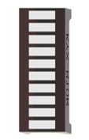
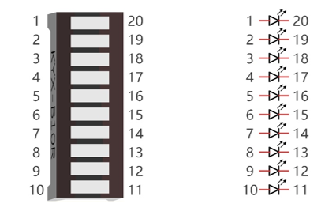
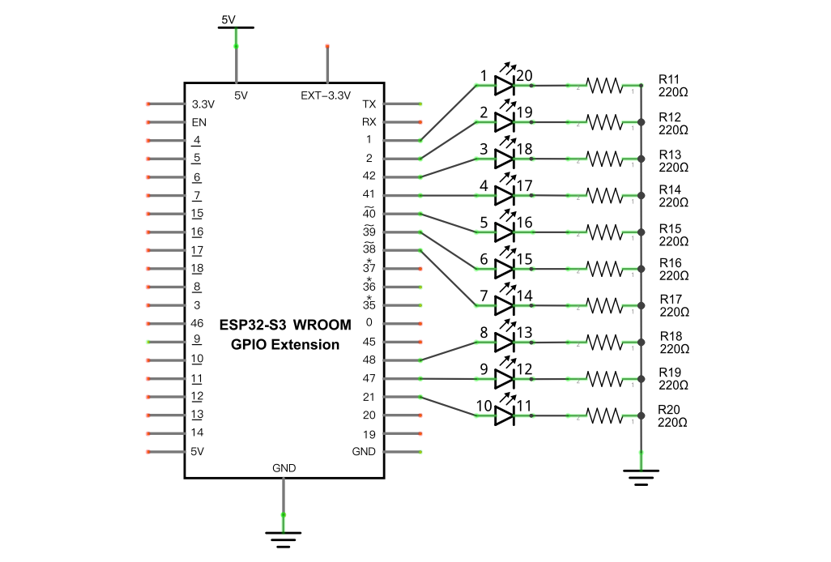
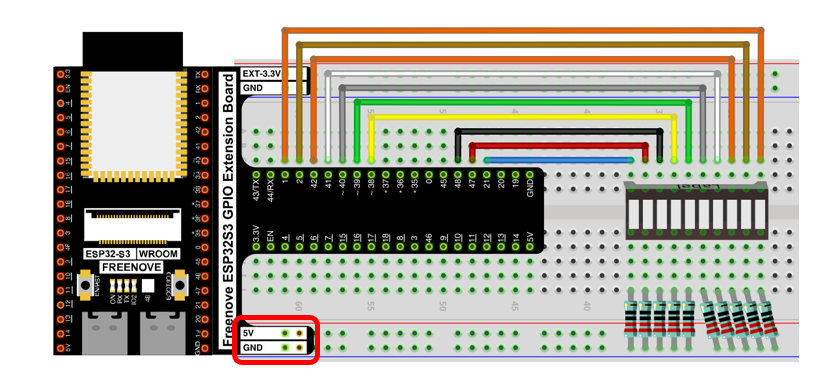
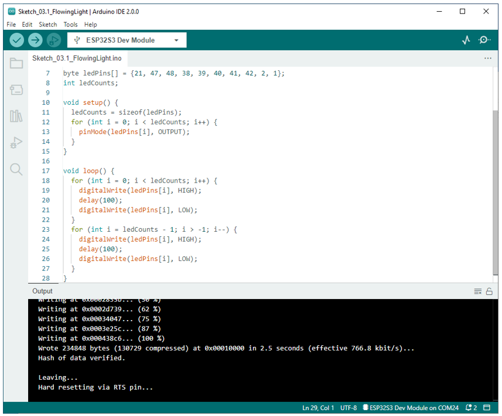
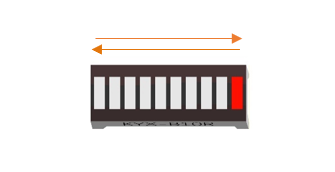

##############################################################################
Chapter LED Bar
##############################################################################

We have learned how to control a LED blinking, next we will learn how to control a number of LEDs.

Project Flowing Light
*************************************

In this project, we use a number of LEDs to make a flowing light.

+-----------------------------+----------------------------------+
| ESP32-S3 WROOM x1           | GPIO Extension Board x1          |
|                             |                                  |
| |Chapter01_00|              | |Chapter01_01|                   |
+-----------------------------+----------------------------------+
| Breadboard x1                                                  |
|                                                                |
| |Chapter01_02|                                                 |
+-------------------+------------------+-------------------------+
| LED bar graph x1  | Resistor 220Ω x10| Jumper M/M x10          |
|                   |                  |                         |
| |Chapter03_00|    | |Chapter01_04|   | |Chapter01_05|          |
+-------------------+------------------+-------------------------+

.. |Chapter01_00| image:: ../_static/imgs/1_LED/Chapter01_00.png
.. |Chapter01_01| image:: ../_static/imgs/1_LED/Chapter01_01.png
.. |Chapter01_02| image:: ../_static/imgs/1_LED/Chapter01_02.png

.. |Chapter01_04| image:: ../_static/imgs/1_LED/Chapter01_04.png
.. |Chapter01_05| image:: ../_static/imgs/1_LED/Chapter01_05.png

Component knowledge
=================================

Let's learn about the basic features of these components to use and understand them better.

LED bar
------------------------------

A LED bar graph has 10 LEDs integrated into one compact component. The two rows of pins at its bottom are paired to identify each LED like the single LED used earlier. 

Circuit
============================

.. list-table::
   :width: 100%
   :header-rows: 1 
   :align: center
   
   * -  Schematic diagram
   * -  |Chapter03_02|
   * -  Hardware connection. 
       
        :red:`If you need any support, please contact us via:` support@freenove.com
   * -  |Chapter03_03|
        
        :red:`If LED bar does not work, try to rotate it for 180°. The label is random.`
    

Sketch
============================

This project is designed to make a flowing water lamp. Which are these actions: First turn LED1 ON, then turn it OFF. Then turn LED2 ON, and then turn it OFF... and repeat the same to all 10 LEDs until the last LED is turns OFF. This process is repeated to achieve the "movements" of flowing water.

Upload following sketch:

**Freenove_Ultimate_Starter_Kit_for_ESP32_S3\\Sketches\\Sketch_03.1_FlowingLight.**

Sketch_FlowingLight
------------------------------

Download the code to ESP32-S3 WROOM and LED bar graph will light up from left to right and from right to left.

The following is the program code:

.. literalinclude:: ../../../freenove_Kit/C/Sketches/Sketch_03.1_FlowingLight/Sketch_03.1_FlowingLight.ino
    :linenos: 
    :language: c
    :dedent:

Use an array to define 10 GPIO ports connected to LED bar graph for easier operation.

.. literalinclude:: ../../../freenove_Kit/C/Sketches/Sketch_03.1_FlowingLight/Sketch_03.1_FlowingLight.ino
    :linenos: 
    :language: c
    :lines: 7-7
    :dedent:

In setup(), use sizeof() to get the number of array, which is the number of LEDs, then configure the GPIO port to output mode. 

.. literalinclude:: ../../../freenove_Kit/C/Sketches/Sketch_03.1_FlowingLight/Sketch_03.1_FlowingLight.ino
    :linenos: 
    :language: c
    :lines: 11-14
    :dedent:

Then, in loop(), use two "for" loop to realize flowing water light from left to right and from right to left.

.. literalinclude:: ../../../freenove_Kit/C/Sketches/Sketch_03.1_FlowingLight/Sketch_03.1_FlowingLight.ino
    :linenos: 
    :language: c
    :lines: 18-27
    :dedent: