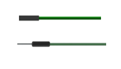
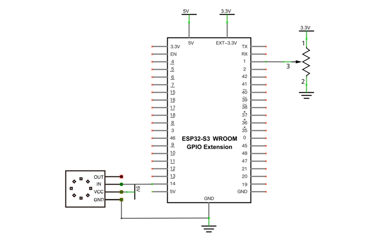
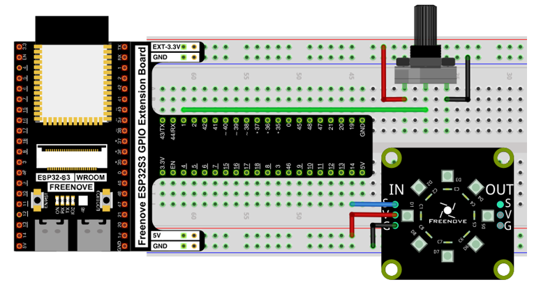

Project Soft Rainbow Light
*****************************************

In this project, we use potentiometer to control Freenove 8 RGB LED Module.

Component List
======================================

+--------------------------------------------+----------------------------------------+
| ESP32-S3 WROOM x1                          | GPIO Extension Board x1                |
|                                            |                                        |
| |Chapter01_00|                             | |Chapter01_01|                         |
+--------------------------------------------+----------------------------------------+
| Breadboard x1                                                                       |
|                                                                                     |
| |Chapter01_02|                                                                      |
+----------------------------------+------------------------+-------------------------+
| Freenove 8 RGB LED Module x1     | Rotary potentiometer x1| Jumper M/M x2           |
|                                  |                        |                         |
|                                  |                        | Jumper M/M x3           |
|                                  |                        |                         |
| |Chapter06_00|                   | |Chapter09_00|         | |Chapter11_06|          |
+----------------------------------+------------------------+-------------------------+

.. |Chapter06_00| image:: ../_static/imgs/6_LEDPixel/Chapter06_00.png

Circuit
=================================

.. list-table::
   :width: 100%
   :header-rows: 1 
   :align: center
   
   * -  Schematic diagram
   * -  |Chapter11_07|

   * -  Hardware connection.
      
        :red:`If you need any support, please feel free to contact us via:` support@freenove.com
     -  |Chapter11_08|

Code
==================================

Open “Thonny”, click “This computer” -> “D:” -> “Micropython_Codes” -> “Soft_Rainbow_Light” and double click “Soft_Rainbow_Light.py”. 

Soft_Rainbow_Light
-----------------------------------

Click “Run current script”. Rotate the handle of potentiometer and the color of the lights will change.

The following is the program code:

.. literalinclude:: ../../../freenove_Kit/Python/Python_Codes/10.3_Soft_Rainbow_Light/Soft_Rainbow_Light.py
    :linenos: 
    :language: python
    :lines: 1-43
    :dedent:

The logic of the code is basically the same as the previous project :ref:`Rainbow Light <Rainbow_Light>`. The difference is that in this code, the starting point of the color is controlled by the potentiometer.