##############################################################################
Chapter Soldering Circuit Board
##############################################################################

Project Soldering a Buzzer
*********************************************

We have tried to use a buzzer in a previous chapter, and now we will solder a circuit that when the button is pressed, the buzzer sounds.

This circuit does not need programming and can work when it is powered on. And when the button is not pressed, there is no power consumption.

You can install it on your bike, bedroom door or any other places where it is needed.

Component List
========================

+------------------+----------------------+------------------+----------------+
| Pin header x2    | LED x1               | Resistor 220Ω x1 | Push button x1 |
|                  |                      |                  |                |
| |Chapter34_00|   | |Chapter34_01|       | |Chapter01_04|   | |Chapter02_02| |
+------------------+----------------------+------------------+----------------+
| Active buzzer x1 | AA Battery Holder x1                                     |
|                  |                                                          |
| |Chapter07_01|   | |Chapter34_02|                                           |
+------------------+----------------------------------------------------------+

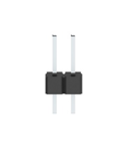
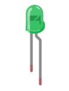
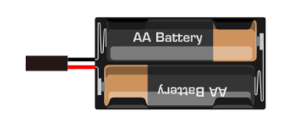
.. |Chapter01_04| image:: ../_static/imgs/1_LED/Chapter01_04.png
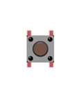
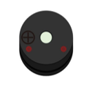

Circuit
=======================

We will solder the following circuit on the main board.

.. list-table::
   :width: 100%
   :header-rows: 1
   :align: center
   
   * -  Schematic diagram
     -  Hardware connection. 
      
        If you need any support, please feel free to 
        
        contact us via: support@freenove.com
 	
   * -  |Chapter34_03|
     -  |Chapter34_04|
 
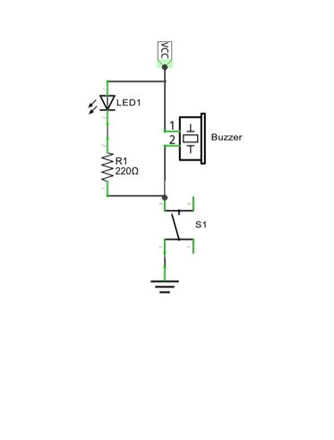
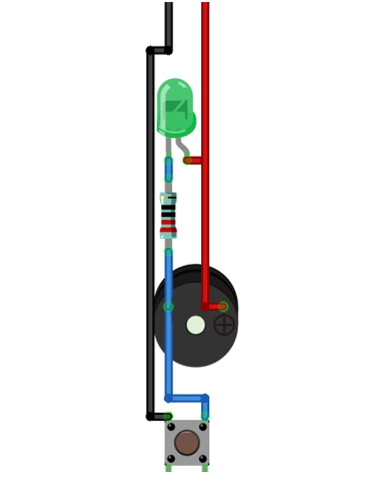

Soldering the Circuit 
=============================

Insert the components on the main board and solder the circuit on its back.

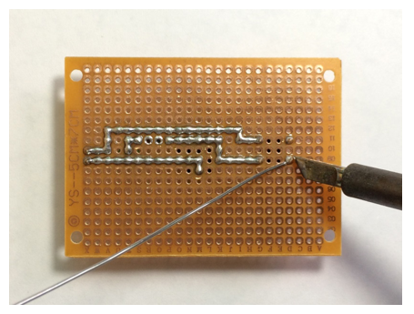

rendering after soldering:

.. list-table::
   :width: 100%
   :header-rows: 1
   :align: center
   
   * -  Front
     -  Back
 	
   * -  |Chapter34_06|
     -  |Chapter34_07|
 
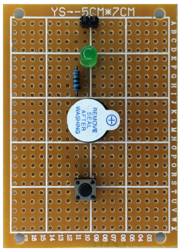
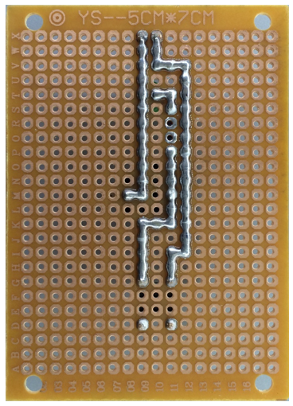

Testing circuit
==========================

Connect the circuit board to power supply (3~5V). You can use ESP32-S3 board or battery box as the power supply.

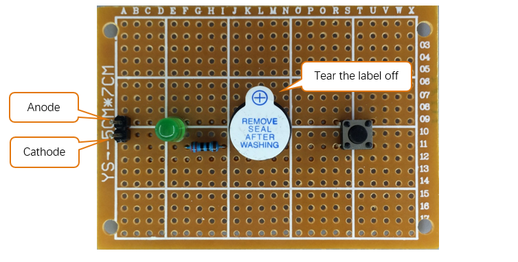

Press the push button after connecting the power, and then the buzzer will make a sound.

Project Soldering a Flowing Water Light
*****************************************************

From previous chapter, we have learned to make a flowing water light with LED. Now, we will solder a circuit board, and use the improved code to make a more interesting flowing water light.

Component List
==============================

.. list-table::
   :width: 100%
   :header-rows: 1
   :align: center
   
   * -  Pin header x5
     -  Resistor 220Ω x8
     -  LED x1
     -  74HC595 x1
 	
   * -  |Chapter34_09|
     -  |Chapter34_10|
     -  |Chapter34_11|
     -  |Chapter34_12|

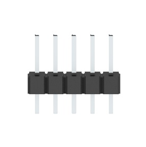
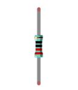
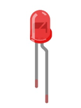
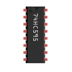

Circuit
===============================

Solder the following circuit on the main board.

.. list-table::
   :width: 100%
   :header-rows: 1
   :align: center
   
   * -  Schematic diagram
     -  Hardware connection. 
      
        If you need any support, please feel free to 
        
        contact us via: support@freenove.com
 	
   * -  |Chapter34_13|
     -  |Chapter34_14|
 
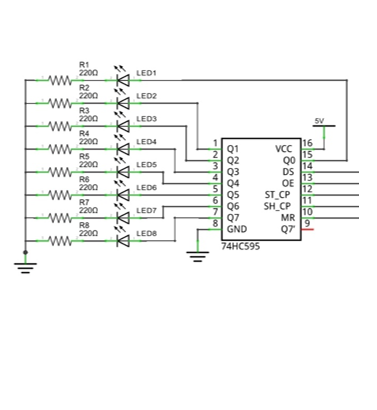
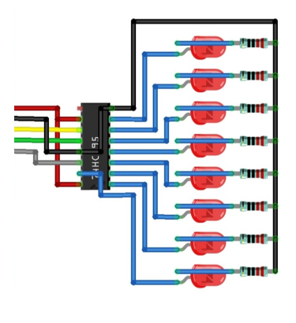

Soldering the Circuit 
============================

Insert the components on the main board and solder the circuit on its back.

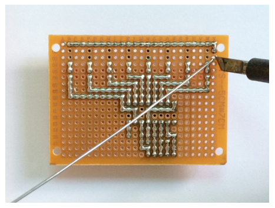

Rendering after soldering:

.. list-table::
   :width: 100%
   :header-rows: 1
   :align: center
   
   * -  Front
     -  Back
 	
   * -  |Chapter34_16|
     -  |Chapter34_17|
 
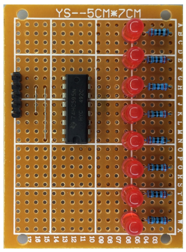
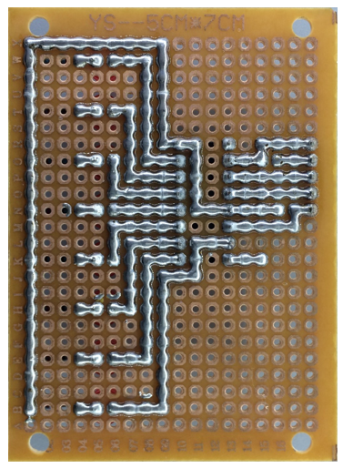

Connecting the Circuit
============================

Connect the board to ESP32-S3 with jumper wire in the following way.

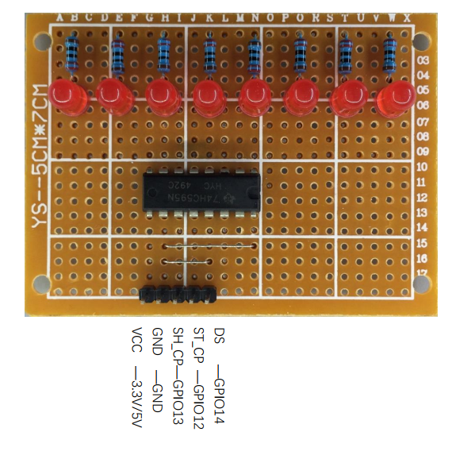

Code
============================

The following is the program code:

.. literalinclude:: ../../../freenove_Kit/Python/Python_Codes/14.1_Flowing_Water_Light/Flowing_Water_Light.py
    :linenos: 
    :language: python
    :dedent: