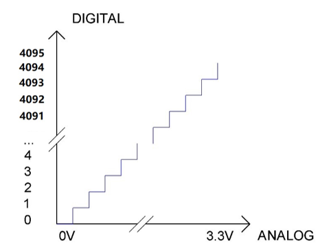
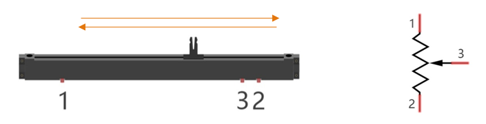
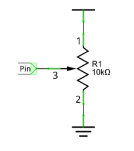
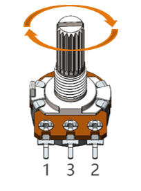
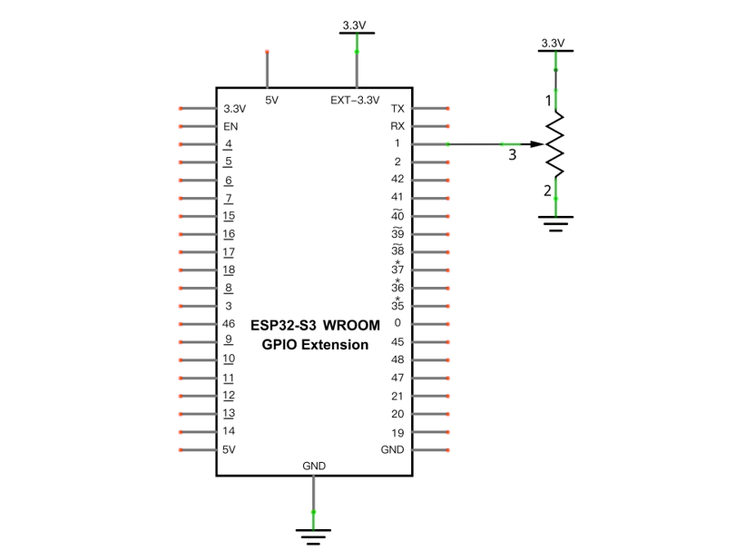
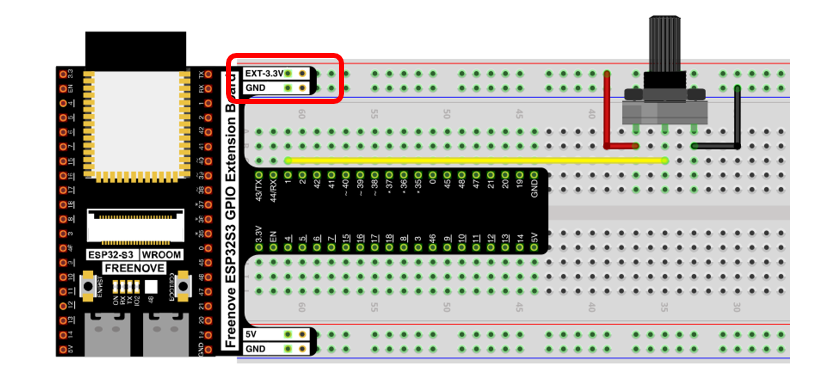
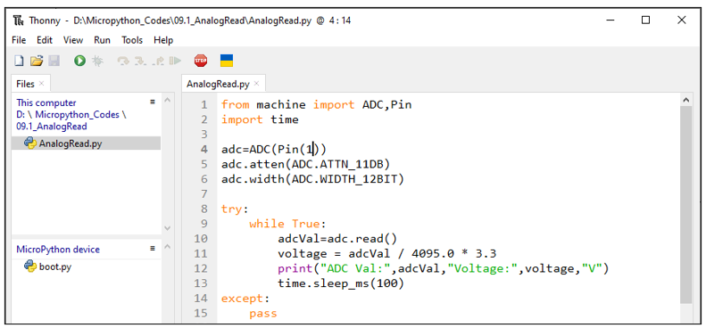
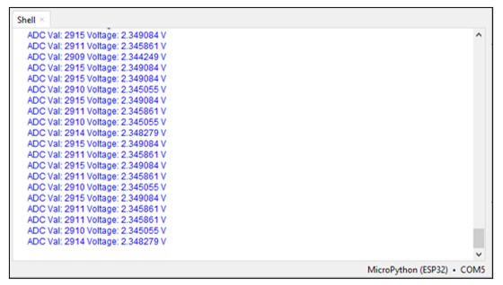

##############################################################################
Chapter AD Converter
##############################################################################

In this chapter, we will learn how to use ESP32-S3 to read analog signals.

Project Read the Voltage of Potentiometer 
********************************************************

In this project, we will use the ADC function of ESP32-S3 to read the voltage value of the potentiometer and print it out through the serial monitor.

Component List
==========================

+-----------------------------+----------------------------------+
| ESP32-S3 WROOM x1           | GPIO Extension Board x1          |
|                             |                                  |
| |Chapter01_00|              | |Chapter01_01|                   |
+-----------------------------+----------------------------------+
| Breadboard x1                                                  |
|                                                                |
| |Chapter01_02|                                                 |
+-----------------------------+----------------------------------+
| Rotary potentiometer x1     | Jumper M/M x3                    |
|                             |                                  |
| |Chapter09_00|              |  |Chapter01_05|                  |
+-----------------------------+----------------------------------+

.. |Chapter01_00| image:: ../_static/imgs/1_LED/Chapter01_00.png
.. |Chapter01_01| image:: ../_static/imgs/1_LED/Chapter01_01.png
.. |Chapter01_02| image:: ../_static/imgs/1_LED/Chapter01_02.png
.. |Chapter01_05| image:: ../_static/imgs/1_LED/Chapter01_05.png
.. |Chapter09_00| image:: ../_static/imgs/9_AD_Converter/Chapter09_00.png

Related knowledge
===========================

ADC
---------------------------

An ADC is an electronic integrated circuit used to convert analog signals such as voltages to digital or binary form consisting of 1s and 0s. The range of our ADC on ESP32-S3 is 12 bits, that means the resolution is 2^12=4096, and it represents a range (at 3.3V) will be divided equally to 4096 parts. The rage of analog values corresponds to ADC values. So the more bits the ADC has, the denser the partition of analog will be and the greater the precision of the resulting conversion.

Subsection 1: the analog in rang of 0V---3.3/4095 V corresponds to digital 0;

Subsection 2: the analog in rang of 3.3/4095 V---2*3.3 /4095V corresponds to digital 1;

......

The following analog will be divided accordingly.

The conversion formula is as follows:

ADC on ESP32-S3
-------------------------

ESP32-S3 has two digital analog converters with successive approximations of 12-bit accuracy, and a total of 20 pins can be used to measure analog signals. GPIO pin sequence number and analog pin definition are shown in the following table.

+-----------------------+-------------+-------------+
| Pin number in Arduino | GPIO number | ADC channel |
+=======================+=============+=============+
| A0                    | GPIO 1      | ADC1_CH0    |
+-----------------------+-------------+-------------+
| A1                    | GPIO 2      | ADC1_CH1    |
+-----------------------+-------------+-------------+
| A2                    | GPIO 3      | ADC1_CH2    |
+-----------------------+-------------+-------------+
| A3                    | GPIO 4      | ADC1_CH3    |
+-----------------------+-------------+-------------+
| A4                    | GPIO 5      | ADC1_CH4    |
+-----------------------+-------------+-------------+
| A5                    | GPIO 6      | ADC1_CH5    |
+-----------------------+-------------+-------------+
| A6                    | GPIO 7      | ADC1_CH6    |
+-----------------------+-------------+-------------+
| A7                    | GPIO 8      | ADC1_CH7    |
+-----------------------+-------------+-------------+
| A8                    | GPIO 9      | ADC1_CH8    |
+-----------------------+-------------+-------------+
| A9                    | GPIO 10     | ADC1_CH9    |
+-----------------------+-------------+-------------+
| A10                   | GPIO 11     | ADC2_CH0    |
+-----------------------+-------------+-------------+
| A11                   | GPIO 12     | ADC2_CH1    |
+-----------------------+-------------+-------------+
| A12                   | GPIO 13     | ADC2_CH2    |
+-----------------------+-------------+-------------+
| A13                   | GPIO 14     | ADC2_CH3    |
+-----------------------+-------------+-------------+
| A14                   | GPIO 15     | ADC2_CH4    |
+-----------------------+-------------+-------------+
| A15                   | GPIO 16     | ADC2_CH5    |
+-----------------------+-------------+-------------+
| A16                   | GPIO 17     | ADC2_CH6    |
+-----------------------+-------------+-------------+
| A17                   | GPIO 18     | ADC2_CH7    |
+-----------------------+-------------+-------------+
| A18                   | GPIO 19     | ADC2_CH8    |
+-----------------------+-------------+-------------+
| A19                   | GPIO 20     | ADC2_CH9    |
+-----------------------+-------------+-------------+

The analog pin number is also defined in ESP32-S3's code base. For example, you can replace GPIO1 with A0 in the code.

Component knowledge
========================================

Potentiometer
------------------------------

A potentiometer is a three-terminal resistor. Unlike the resistors that we have used thus far in our project which have a fixed resistance value, the resistance value of a potentiometer can be adjusted. A potentiometer is often made up by a resistive substance (a wire or carbon element) and movable contact brush. When the brush moves along the resistor element, there will be a change in the resistance of the potentiometer's output side (3) (or change in the voltage of the circuit that is a part). The illustration below represents a linear sliding potentiometer and its electronic symbol on the right.

What between potentiometer pin 1 and pin 2 is the resistor body, and pins 3 is connected to brush. When brush moves from pin 1 to pin 2, the resistance between pin 1 and pin 3 will increase up to body resistance linearly, and the resistance between pin 2 and pin 3 will decrease down to 0 linearly.

In the circuit. The both sides of resistance body are often connected to the positive and negative electrode of the power. When you slide the brush pin 3, you can get a certain voltage in the range of the power supply.

Rotary potentiometer 
------------------------------

Rotary potentiometer and linear potentiometer have similar function; their only difference is: the resistance is adjusted by rotating the potentiometer.

Circuit
============================

.. list-table::
   :width: 100%
   :header-rows: 1 
   :align: center
   
   * -  Schematic diagram
   * -  |Chapter09_06|

   * -  Hardware connection.
      
        :red:`If you need any support, please feel free to contact us via:` support@freenove.com
     -  |Chapter09_07|

Code
===============================

Move the program folder “Freenove_Ultimate_Starter_Kit_for_ESP32_S3/Python/Python_Codes” to disk(D) in advance with the path of “D:/Micropython_Codes”.

Open “Thonny”, click “This computer” -> “D:” -> “Micropython_Codes” -> “AnalogRead and then click “AnalogRead.py”. 

AnalogRead  
-------------------------------

Click “Run current script” and observe the message printed in “Shell”.

The following is the code:

.. literalinclude:: ../../../freenove_Kit/Python/Python_Codes/09.1_AnalogRead/AnalogRead.py
    :linenos: 
    :language: python
    :lines: 1-15
    :dedent:

Import Pin, ADC modules.

.. literalinclude:: ../../../freenove_Kit/Python/Python_Codes/09.1_AnalogRead/AnalogRead.py
    :linenos: 
    :language: python
    :lines: 1-2
    :dedent:

Turn on and configure the ADC with the range of 0-3.3V and the data width of 12-bit data width.

.. literalinclude:: ../../../freenove_Kit/Python/Python_Codes/09.1_AnalogRead/AnalogRead.py
    :linenos: 
    :language: python
    :lines: 4-6
    :dedent:

Read ADC value once every 100 millisecods, convert ADC value and print these data to “Shell”.

.. literalinclude:: ../../../freenove_Kit/Python/Python_Codes/09.1_AnalogRead/AnalogRead.py
    :linenos: 
    :language: python
    :lines: 9-13
    :dedent:

Reference
----------------------------------

.. py:function:: Class ADC	

    Before each use of ACD module, please add the statement “from machine import ADC” to the top of the python file.
    
    **machine.ADC(pin):** Create an ADC object associated with the given pin.
    
        **pin:** Available pins are: Pin(1-18)。
    
    **ADC.read():** Read ADC and return the value.
    
        **ADC.atten(db):** Set attenuation ration (that is, the full range voltage, such as the voltage of 11db full range is 3.3V)
    
        **db:** attenuation ratio
    
        **ADC.ATTIN_0DB**    —full range of 1.2V
    
        **ADC.ATTN_2_5_DB**  —full range of 1.5V
    
        **ADC.ATTN_6DB**    —full range of 2.0 V
    
        **ADC.ATTN_11DB**   —full range of 3.3V
    
    **ADC.width(bit):** Set data width.
    
        **bit:** data bit
    
        **ADC.WIDTH_9BIT**  —9 data width 
    
        **ADC.WIDTH_10BIT** — 10 data width
    
        **ADC.WIDTH_11BIT** — 11 data width
    
        **ADC.WIDTH_12BIT** — 12 data width 