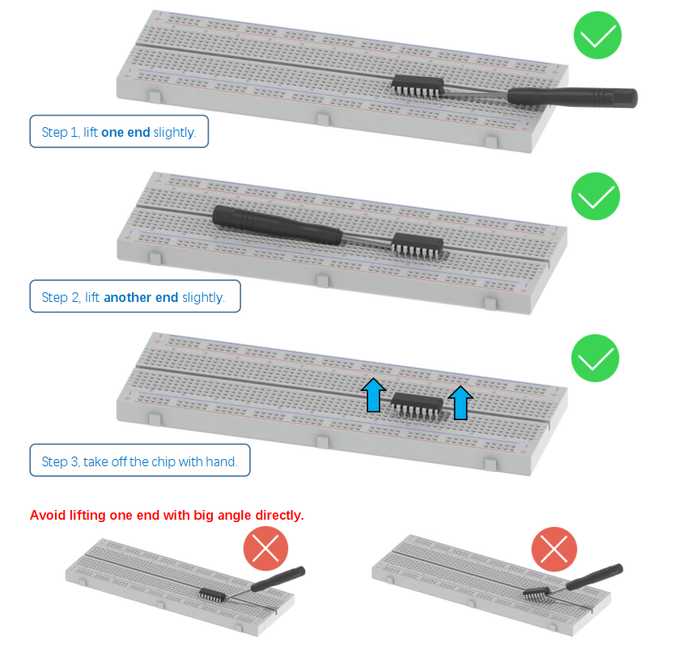

##############################################################################
Remove the Chips
##############################################################################

Some chips and modules are inserted into the breadboard to protect their pins.

You need to remove them from breadboard before use. (There is no need to remove GPIO Extension Board.)

Please find a tool (like a little screw driver) to handle them like below:

